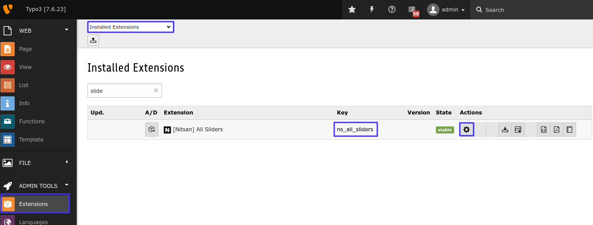
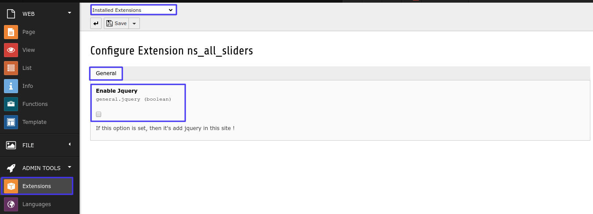
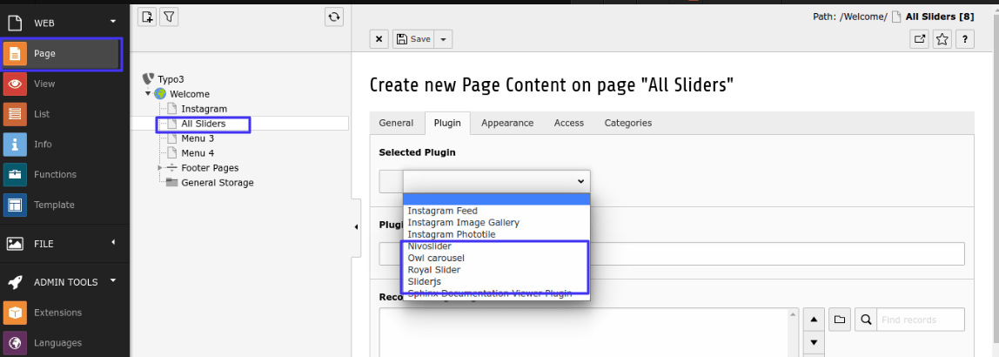
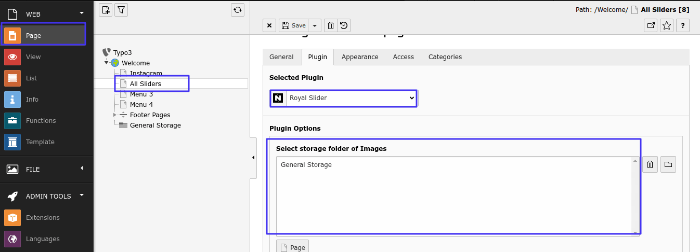

.. ==================================================
.. FOR YOUR INFORMATION
.. --------------------------------------------------
.. -*- coding: utf-8 -*- with BOM.

.. include:: ../../Includes.txt

.. _configuration:

Configuration
==============

Quick & Easy configuration of "All Sliders" into TYPO3
-------------------------------------------------------

**Step 1:** Switch to the *Template module* and select *Constant Editor*.

**Step 2:** Select Category as follows *PLUGIN.TX_NSALLSLIDERS_OWLCAROUSEL (17), PLUGIN.TX_NSALLSLIDERS_ROYALSLIDER (29), PLUGIN.TX_NSALLSLIDERS_SLIDERJS (14), PLUGIN.TX_NSALLSLIDERS_NIVOSLIDER (4)* You can configure it as per your requirement.

.. figure:: Images/TYPO3-EXTns_all_sliders-config-1-min.png
  :width: 800px
  :alt: Configuration 1
.. :border: 1
.. :align: left

**Step 3:** *Include Jquery* if you have not included yet in your project.

.. :border: 1
.. :align: left

.. :border: 1
.. :align: left

**Step 4:** Create *Storage Folder* for this plugin.

.. figure:: Images/TYPO3-EXTns_all_sliders-config-4-min.png
  :width: 800px
  :alt: Configuration 4
.. :border: 1
.. :align: left

**Step 5:** Add those plugins in to page where you want to use these sliders. And configure it as per your requirement.

.. :border: 1
.. :align: left

**Step 6:** Add *Storage Folder* where your slider images are stored.

.. :border: 1
.. :align: left