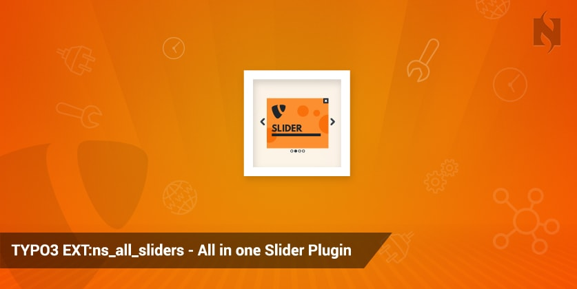
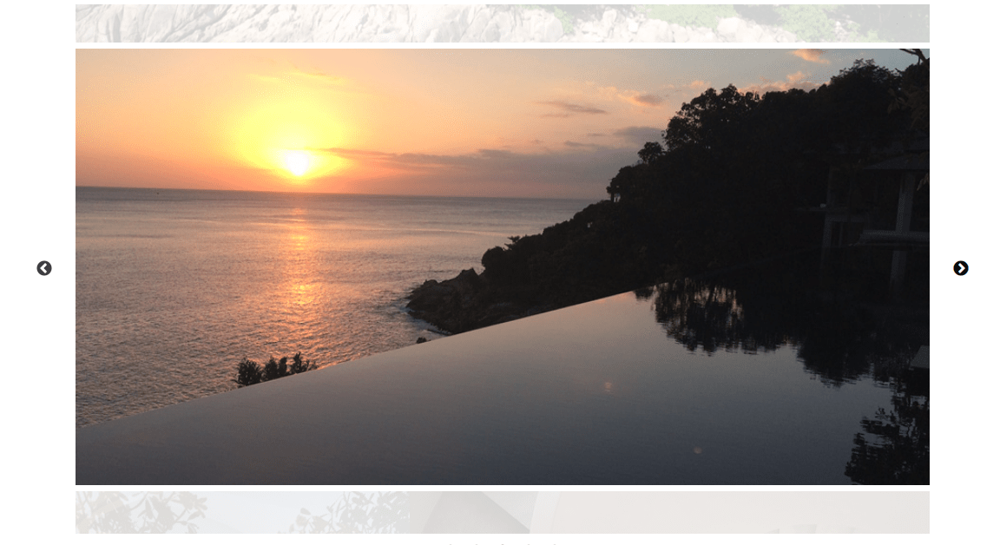


.. include:: ../Includes.txt

============
Introduction
============

ext:ns_all_sliders
================

.. _What-does-it-do:

What does it do?
================

One of the only TYPO3 extension which provides to use most popular jQuery slider plugins at your website. This TYPO3 extension provides to configure sliders eg., **Nivo Slider, Royal Slider, Owlcarousel, Sliderjs Slider** & more will be available in an upcoming version.

.. _Some-impressions:

Some impressions
================

**1. Nivo Slider**
------------------

**2. Owlcarousel Slider**
-------------------------

**3. Royal Slider**
--------------------

**4. Slidejs Slider**
--------------------

**5. Slick Slider**
--------------------

